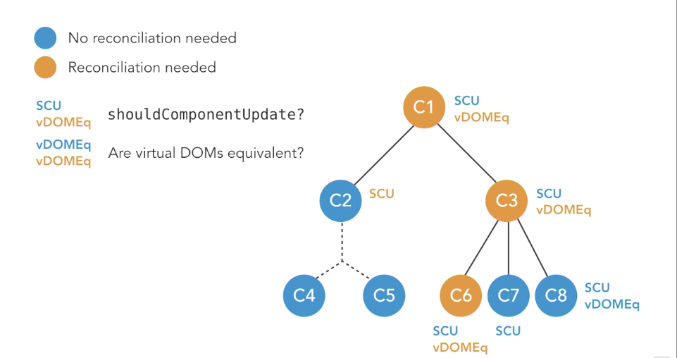

# React: Lifecycles
======
[LinkedIn Course](https://www.linkedin.com/learning/react-lifecycles/welcome)

## Getting Started
- $ Yarn install
- $ Yarn start

## Built With
- React, Logger.

## Acknowledgments
- Carl Peaslee

# Notes:
------
### Logger overview
- every time one of the lifecycle `methods` gets run by one of our two `components`,
we have a parent and child, we're going to see that happen in the console.
So let's see, we can pass new `props`. And when we pass the new `props`, we see our
console run through each of the lifecycle methods that happen. We can also see
what happens when you hide a `child`. We see that the component will unmount.

### Building a higher-order component (HOC)
- Higher-order components are functions that accept a component, or multiple
components, as arguments and then return a new, modified component.

- ^ we've got this box that says `Parent` and has these buttons in it and then
this red box represents a `parent` `component` and then inside of it, it has
it's `child`. And so it's `child` is another `component`. Every time one of our
`Parent` or `Child` invokes a life cycle method, those are logged to the Console.
- a higher-order `component` is essentially just creating a `component` to wrap another `component`
- [HOC Docs](https://facebook.github.io/react/docs/higher-order-components.html)

### Virtual DOM
- Lifecycle Methods (three categories: methods that happen during the creating
  phase, methods that are happening during the mounting phase, and those that are
  part of the updating phase.)
  - Creating
    - displayName
    - defaultProps
    - initial state
  - Mounting
    - constructor
    - componentWillMount
    - render
    - componentDidMount
    - componentWillUnmount
  - Updating
    - setState
    - componentWillReceiveProps
    - shouldComponentUpdate
    - componentWillUpdate
    - render
    - componentDidUpdate
- How Does React Update the DOM?

  - JavaScript object in memory that represents what the website looks like.
  - a lot of the speed bonuses that you get for using React is because it is diffing the virtual DOM versus the real DOM and trying to minimize the number of changes it makes to the real DOM. React is already fairly performant on its own, but by leveraging the lifecycle methods correctly, we can improve that out of the box speed. A good understanding of the lifecycle methods will allow us to ensure our components are achieving the right functionality with the most efficient amount of code and help us avoid quirky, asynchronous problems involving state changes.

### Quiz
- Whenever a user takes an action, React immediately updates the entire DOM.
  - False
- Which choice would be considered a higher-order component?
  - A function that accepts a component and returns a modified version of that component.
