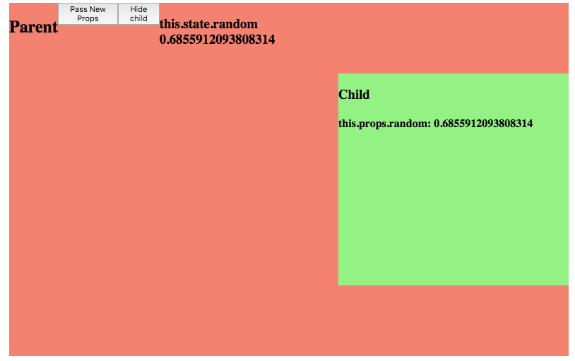

# React: Lifecycles
======
[LinkedIn Course](https://www.linkedin.com/learning/react-lifecycles/welcome)

## Getting Started
- $ Yarn install
- $ Yarn start

## Built With
- React, Logger.

## Acknowledgments
- Carl Peaslee

# Notes:
------
### Logger overview
- every time one of the lifecycle `methods` gets run by one of our two `components`,
we have a parent and child, we're going to see that happen in the console.
So let's see, we can pass new `props`. And when we pass the new `props`, we see our
console run through each of the lifecycle methods that happen. We can also see
what happens when you hide a `child`. We see that the component will unmount.

### Building a higher-order component (HOC)
- Higher-order components are functions that accept a component, or multiple
components, as arguments and then return a new, modified component.

- ^ we've got this box that says `Parent` and has these `button`s in it and then
this red box represents a `parent` `component` and then inside of it, it has
it's `child`. And so it's `child` is another `component`. But now, if you look
on the right here in the Console, you can see that we've got this kind of cool
functionality where every time one of our `Parent` or `Child` invokes a life cycle
method, that those are logged to the Console.
- a higher-order `component` is essentially just creating a `component` to wrap another `component`
- [HOC Docs](https://facebook.github.io/react/docs/higher-order-components.html)

### Virtual DOM

### Quiz
